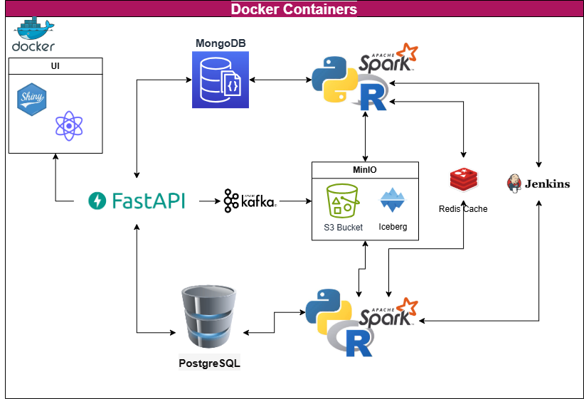

<p align="center">
    <a href=""></a>
</p>
<p align="center">
    <em>Big Data in Quantitative Finance @ Institute for Finance and Technology UCL</em>
</p>

---

# Welcome

Welcome to the primary repository for our course on Big Data in Quantitative Finance.

This class employs a specific technology stack to support our learning objectives and practical activities. The diagram below illustrates the key components of this stack, which will serve as the foundation for our coursework and projects throughout the semester.

<p align="center">
    <a href=""></a>
</p>

This carefully selected combination of tools and technologies will enable us to effectively explore and apply big data concepts within the context of quantitative finance.

**Navigate to the subfolder to see the code.**

*Clone this Git Repository to have your script always updated on your local machine*

## Contributing

---

This project welcomes contributions and suggestions. It is highly recommended to read and understand Coding Best Practices listed in the wiki attached to this repository [Link](https://github.com/iftucl/ift_big_data)

Please, use following workflow:

+ Clone this repo ("git clone https://github.com/iftucl/ift_big_data.git")

+ cd into the repo directory by:

```

cd ./ift_big_data

```

+ create a new branch

```

git checkout -b newBranchName

```

+ copy in your local repo your developments

+ Add, Commit and Push

```

git add --all
git commit -m "Message template to be Edited"
git push -u origin newBranchName

```

+ Create a pull request

## Docker

---

This repo can be also run with Docker. In order to do so, please install Docker.

### Prerequisites

You need to have Docker Engine and Docker Compose on your machine. You can either:

- Install [Docker Engine](https://docs.docker.com/get-docker/) and [Docker Compose](https://docs.docker.com/compose/install/) as standalone binaries or
- Install [Docker Desktop](https://docs.docker.com/desktop/) which includes both Docker Engine and Docker Compose

*Recommended second option*

For Windows users, it is necessary to have the followings:

* WSL 2 backend
* Windows 11 64-bit: Home or Pro version 21H2 or higher, or Enterprise or Education version 21H2 or higher.
* Windows 10 64-bit: Home or Pro 21H1 (build 19043) or higher, or Enterprise or Education 20H2 (build 19042) or higher.
* Enable the WSL 2 feature on Windows. For detailed instructions, refer to the Microsoft documentation.
* The following hardware prerequisites are required to successfully run WSL 2 on Windows 10 or Windows 11:

### Run docker containers

To run, cd in this directory and:

```

docker build
docker compose up

```
or

```

docker compose up --build

```

**Please note**: the build of all containers might take some time, it is suggested to build and start only the containers needed:

```

docker compose up --build -d mongo_db

```

which would build (`--build`) and start (`up`) in detached mode (`-d`) the Mongodb Container.

### pgadmin

The web hosted PGAdmin Interface listens is available at `localhost:5050`

In order to access, use the username `admin@admin.com` and password `root` as specified in Docker File under the node pg-admin.

```
host: host.docker.internal

```