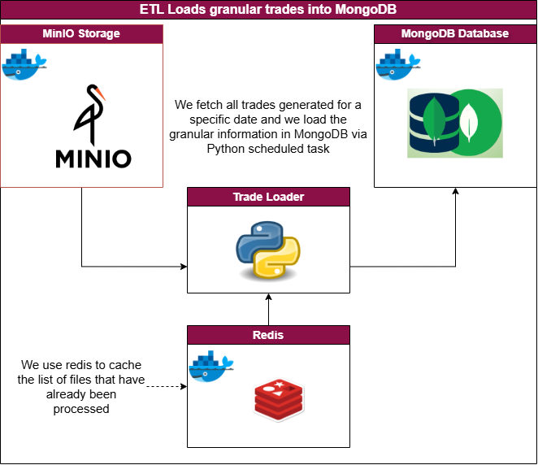

# MongoDB Data Loader

## Introduction

Script to load trades (csv files) into MongoDB.

Input folder to database specifications:

- minio folder: ''
- mongodb: Database = Trades; Collection = TradingRecord


<p align="center">
    <a href=""></a>
</p>


## Depends on

To run this script you will need to start `MongoDB`, `Minio` and `Redis` containers.

If you haven't yet build these containers, then:

```bash

docker compose up minio mongodb redis -d

```

else, if the containers are already build, then:

```bash

docker compose start minio mongodb redis -d

```

## Configuration

configuration file is stored in properties/conf.yaml. The configurations can be amended without affecting code logic.

## Script Trigger

in order to trigger this script:

```bash
cd ./Scripts/Python/1_ETL_MongoDB
poetry run python main.py --env_type='dev'

```