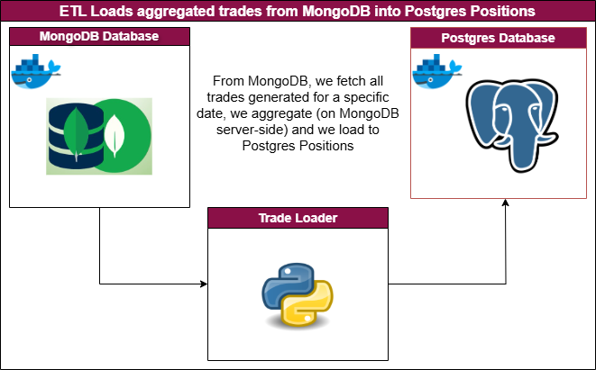

# ETL Mongodb to Postgres

This script aggregates granular trades stored in MongoDB and transfer them into portfolio positions table in postgres.
To be more precise, we could almost call this process an ELT as the transformation (data aggregation) happens in the MongoDB server.


## Introduction

Script to aggregate trades from MongoDB and load to postgresql positions table.

<p align="center">
    <a href=""></a>
</p>


Input Mongo database to SQLite database specifications:

- mongodb: Database = Trades; Collection = TradingRecord
- SQLite: Table = trader_positions (create if not exist from SQLite client class in modules/db/sqlite_db.py)


## Depends on

In order to run this script you need to have two services available: mongodb (`mongo_db`) and postgresql (`postgres_db`).

In order to start the two containers:

```bash

docker compose start mongo_db postgres_db

```

## Configuration

configuration file is stored in properties/conf.yaml. The configurations can be amended without affecting code logic.

## Script Trigger

in order to trigger this script:

```bash
cd ./Scripts/Python/4_ETL_Mongob_SQL
poetry run python main.py --date_run 2023-11-23

```