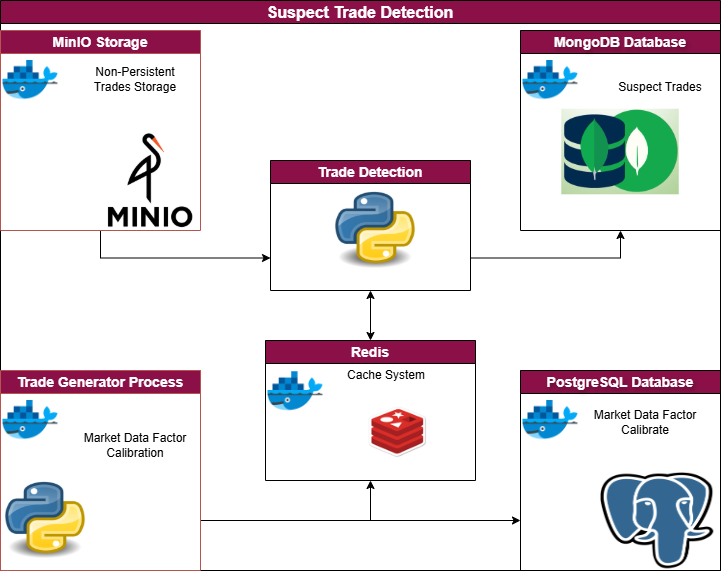

# VALIDATE TRADES


Validate trades delivered via file system.

<p align="center">
    <a href=""></a>
</p>


## HOW TO: Configuration

configuration file is stored in properties/conf.yaml. The configurations can be amended without affecting code logic.

## HOW TO: Depends on?

To run this script you will need to start `minio` and `redis` containers.

If you haven't created these containers yet, please run:

```bash

docker compose up minio redis -d

```

else, if the containers already exists:

```bash

docker compose start minio redis

```

## Script trigger

Script can be triggered as:

```bash

cd Scripts/Python/5_Trades_Validate
poetry run python main.py --date_run='2023-11-23' --env_type='dev'

```

Please note command arg while the `--env_type` is required `--date_run` is not mandatory.

In order to get a summary of main command args available:

```bash

python main.py --help

```

### Debug mode

Run it locally as:

```python

import os
os.chdir("Scripts/Python/5_Trades_Validate")

```


